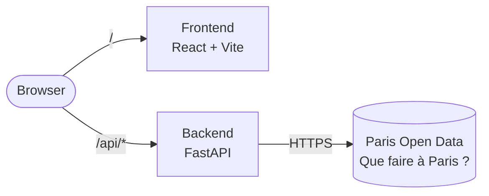
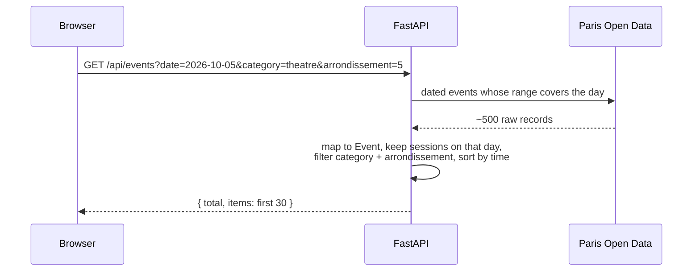
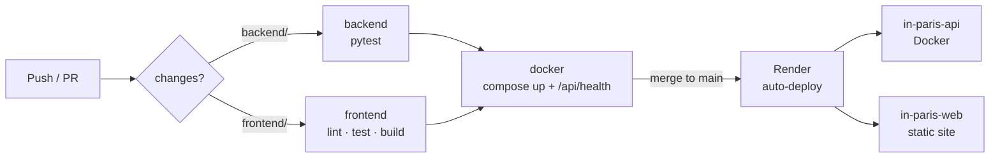

# In Paris

Find cultural events in Paris day by day: concerts, theatre, exhibitions, sport… on a list and a map.

**Live:** https://in-paris-web.onrender.com
(free hosting on Render: the API sleeps when unused)

## Features

- Events of the day, sorted by time, 30 at a time ("load more")
- Day strip for the week + calendar for any date
- 8 categories, each with its colour on the map
- Map of Paris: click arrondissements to filter, hover a marker to see the event
- Event card: address, price, link, copy address or GPS coordinates
- Instant navigation between days (cache + next day preloaded)

## Architecture



The browser always calls `/api`. It is forwarded to the backend by the Vite proxy (dev), nginx (Docker) or Render (prod), so the frontend never needs the backend URL and there is no CORS.

### How a request works



## Tech stack

| | |
|---|---|
| **Backend** | Python 3.12, FastAPI, httpx (async), Pydantic, pytest |
| **Frontend** | React 19, TypeScript, Vite, Tailwind CSS v4, TanStack Query, react-leaflet, date-fns, Vitest |
| **Data** | [Que faire à Paris ?](https://opendata.paris.fr/explore/dataset/que-faire-a-paris-/) (Paris Open Data, no API key) |
| **Ops** | Docker, docker compose, GitHub Actions, Render |

## Run it

### With Docker (simplest)

```bash
cp backend/.env.example backend/.env
cp frontend/.env.example frontend/.env
docker compose up --build
```

Open http://localhost:8080.

### Without Docker

```bash
# Terminal 1 — API on http://localhost:8000 (docs: /docs)
cd backend
python -m venv .venv
source .venv/bin/activate          # Windows: .venv\Scripts\activate
pip install -r requirements-dev.txt
cp .env.example .env
uvicorn app.main:app --reload

# Terminal 2 — app on http://localhost:5173
cd frontend
npm install
npm run dev
```

### Tests

```bash
cd backend && pytest           # 15 tests, Paris API mocked
cd frontend && npm test        # 19 tests
```

## CI/CD



- **CI** ([ci.yml](.github/workflows/ci.yml)): only the changed parts are checked; the docker job proves the images build and nginx reaches the API.
- **CD** ([render.yaml](render.yaml)): Render redeploys a service when its folder changes, after the CI is green.
- **Self-hosting**: `docker compose -f docker-compose.prod.yml up --build -d` on any VM (read-only containers, non-root, auto-restart).

## Configuration

Each part has a `.env.example` to copy to `.env` (dev) or `.env.prod` (prod). Real `.env` files are git-ignored.

| Variable | Where | Purpose |
|---|---|---|
| `PARIS_API_BASE_URL`, `PARIS_API_DATASET`, `PARIS_API_TIMEOUT` | backend | Open Data API |
| `ENVIRONMENT` | backend | `production` hides `/docs` |
| `BACKEND_URL` | frontend (Docker) | where nginx forwards `/api` |

## Project structure

```
backend/
  app/
    api/        routes and validation
    services/   day / category / arrondissement filtering, sorting, paging
    clients/    calls to the Paris API
    utils/      raw record -> Event (the only code that knows the API fields)
    schemas/    Pydantic models
  tests/
frontend/
  src/
    api.ts, types.ts      the only place that calls the backend
    hooks/useEvents.ts    TanStack Query: cache, pagination, prefetch
    components/           ui · layout · events · map
    config.ts, texts.ts   settings and UI copy
docker-compose.yml        local run
docker-compose.prod.yml   self-hosting
render.yaml               deployment
```
